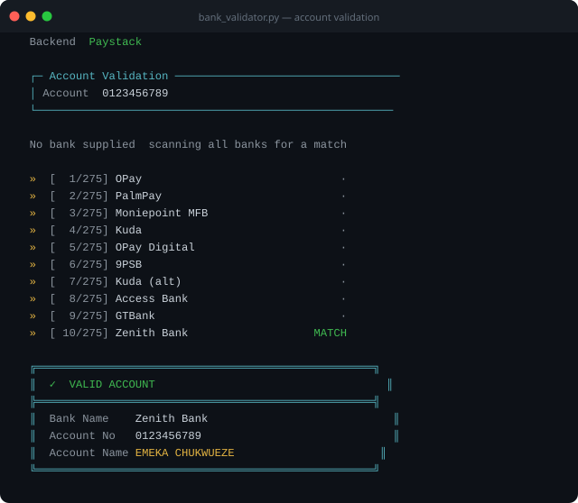
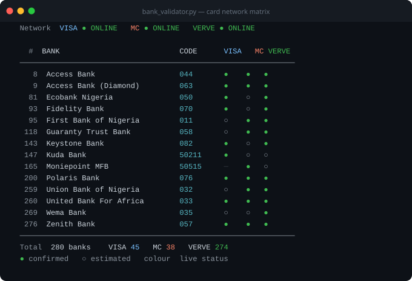

# 🏦 Bank Validator

Bank Validator is a Python command line tool for Nigerian banking. It resolves NUBAN account numbers to holder names through live NIBSS integration, monitors transfer network availability across all registered Nigerian banks, and maps Visa, Mastercard, and Verve card support per bank in real time.

Requires Python 3 and curl. No pip installs needed.

---

## Features

### 🔍 Account Name Enquiry

Enter any 10 digit Nigerian NUBAN account number. The tool scans registered banks in smart priority order and returns the verified account holder name directly from NIBSS.

### 🏦 Bank Network Monitor

Lists all 280 plus CBN registered Nigerian banks with a live connectivity check on their NIP transfer infrastructure. Shows which banks are reachable for transactions right now.

### 💳 Card Network Matrix

Displays every Nigerian bank alongside the card schemes it issues and checks the live gateway status of each payment network at the same time.

**●** solid dot  Confirmed via Paystack BIN data  
**○** hollow dot  Estimated from bank category  
**colour**  Live gateway status at time of check

### 🔢 BIN Lookup

Enter the first 6 to 16 digits of any card number. Returns the issuing bank, card network, and card type.

### 🔄 BIN Database Refresh

Queries Paystack BIN endpoints for all known Nigerian banks and caches results locally. Makes future card matrix lookups faster and more accurate.

---

## Screenshots





---

## Setup

```bash
cd "bank validator/backend"
python3 bank_validator.py
```

For accurate NIBSS resolution, set a Paystack key before running:

```bash
export PAYSTACK_SECRET_KEY=sk_live_your_key_here
python3 bank_validator.py
```

The key can also be saved interactively via option **8** in the menu. Once saved it persists across sessions.

If no key is provided the tool auto acquires a NubAPI token at startup and uses that as a fallback.

---

## Usage

Launch the interactive menu:

```bash
python3 bank_validator.py
```

Direct CLI commands:

```bash
# Validate an account number (auto scans all banks)
python3 bank_validator.py --account 0123456789

# Card network matrix with live gateway status
python3 bank_validator.py --card-matrix

# Look up a card BIN
python3 bank_validator.py --card 539983

# Bank transfer network monitor
python3 bank_validator.py --monitor

# Refresh BIN database from Paystack
python3 bank_validator.py --scan-bins

# Filter card matrix to one network
python3 bank_validator.py --card-matrix --filter-net visa
```

---

## Menu Options

| Option | Description |
|--------|-------------|
| 1 | Validate a bank account |
| 2 | Bank network monitor |
| 3 | Card network status (live gateway probe) |
| 4 | Card issuance matrix with live status |
| 5 | Card BIN lookup |
| 6 | Active banks only |
| 7 | About |
| 8 | Set API key |
| 9 | Refresh BIN database |

---

## Requirements

* Python 3.8 or later
* curl (available by default on macOS and most Linux distributions)
* Paystack secret key (optional, recommended for full NIBSS resolution)

---

Made by **Krainium**
